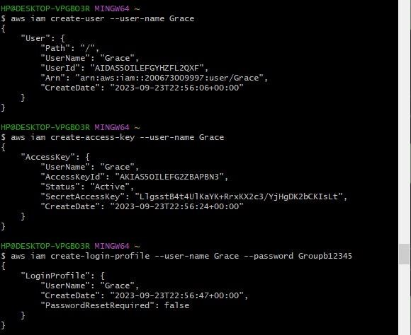
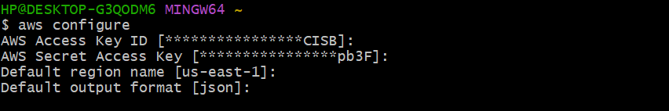
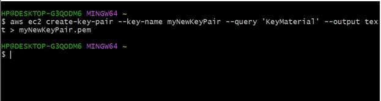
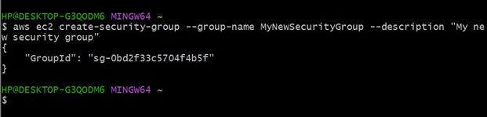
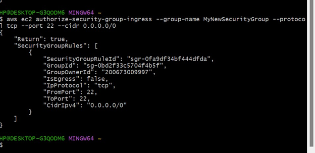
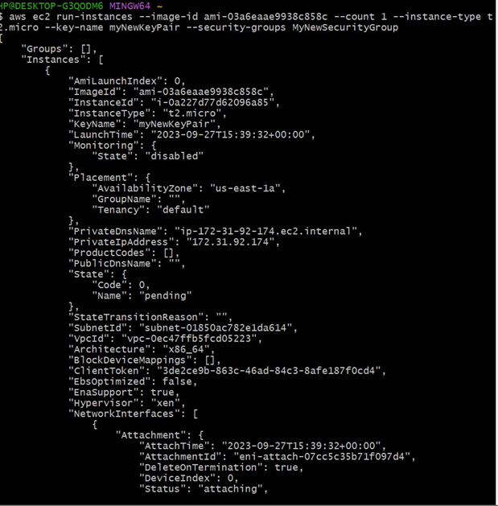
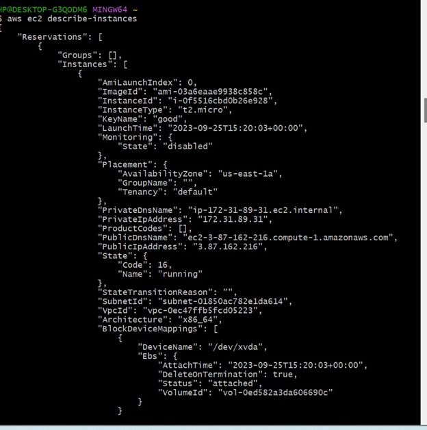
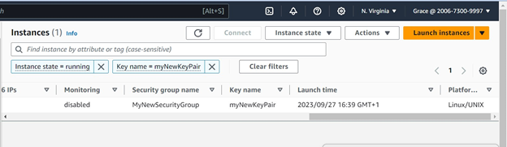
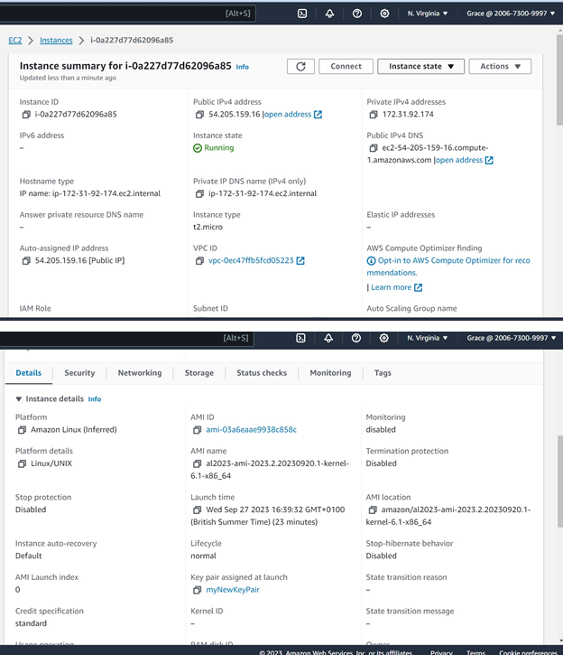

# launching an EC2 instance from the command line using an IAM user with the necessary permissions.
## STEP 0: Prerequisites:
* AWS account
* IAM user credentials
* IAM user group with necessary permissions 
## STEP1:  AWS CLI Installation and Configuration:
- Install AWS CLI
- Run ```aws configure``` and input IAM user credentials (access key and secret key) along with default region settings.

## STEP2: Creating a key pair
- ```aws ec2 create-key-pair --key-name myNewKeyPair --query 'KeyMaterial' --output text > myNewKeyPair.pem```
- “mynewkeypair” is the unique key pair name. 
## STEP3: Creating Security Group
- ```aws ec2 create-security-group --group-name MyNewSecurityGroup --description "MyNewsecuritygroup"```
- “My New Security Group” is the unique security group name 
## STEP4: Allow SSH Port
- ```aws ec2 authorize-security-group-ingress --group-name MyNewSecurityGroup --protocol tcp --port 22 --cidr 0.0.0.0/0``` 
## STEP5: Launching the instance
- ```aws ec2 run-instances --image-id ami-03a6eaae9938c858c --count 1 --instance-type t2.micro -- key-name myNewKeyPair --security-groups MyNewSecurityGroup``` 
## STEP6: Describe the instance/instance details
```aws ec2 describe-instances```

## STEP7: View instance on AWS management console
- Log in to your AWS account using your IAM user credentials.
- In the AWS Management Console, click on "Services" in the top left corner.
- Under the "Compute" section, select "EC2" to access the EC2 Dashboard.
- In the EC2 Dashboard, you'll find the "Instances" option in the left-hand navigation pane. Click on it to view your EC2 instances.
- You should see a list of EC2 instances associated with your IAM user in the main panel. This list will display information about each instance, such as its instance ID, state, instance type, and more.
- Locate the EC2 instance that you created using the AWS CLI by checking its instance ID or other details.
- To view detailed information about the instance, including its configuration, security groups, public IP address, and more, select the instance by clicking the checkbox next to its name and then click the "Description" tab at the bottom panel. Here, you'll find comprehensive information about the selected EC2 instance.
    